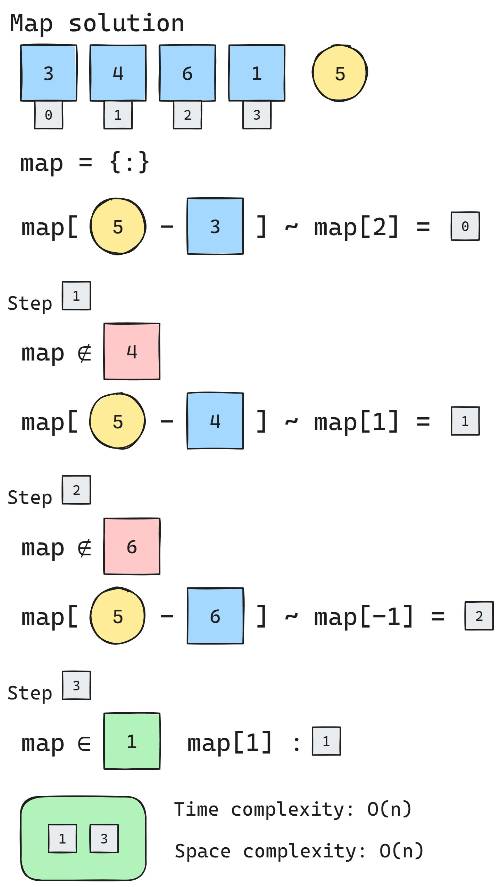
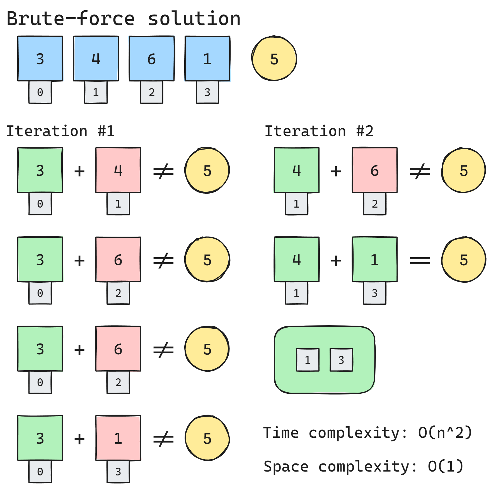

# [1. Two Sum](https://leetcode.com/problems/two-sum)

## Map Solution

- [Java code](https://github.com/alexengrig/leetcode/blob/main/src/main/java/dev/alexengrig/leetcode/_1_two_sum/BruteForceSolution.java)
- [Python code](https://github.com/alexengrig/leetcode/blob/main/src/main/python/1_two_sum/map_solution.py)

**Time complexity: O(n)**

**Space complexity: O(n)**

## [Brute-force code](https://github.com/alexengrig/leetcode/blob/main/src/main/java/dev/alexengrig/leetcode/_1_two_sum/BruteForceSolution.java)

