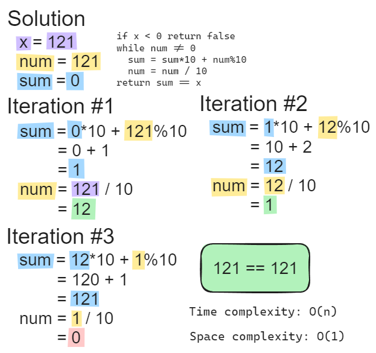

# [9. Palindrome Number](https://leetcode.com/problems/palindrome-number/)

## [Solution code](https://github.com/alexengrig/leetcode/blob/main/src/main/java/dev/alexengrig/leetcode/_9_palindrome_number/Solution.java)



```
Runtime: 4 ms, faster than 100.00% of Java online submissions for Palindrome Number.
Memory Usage: 43.5 MB, less than 90.60% of Java online submissions for Palindrome Number.
```
